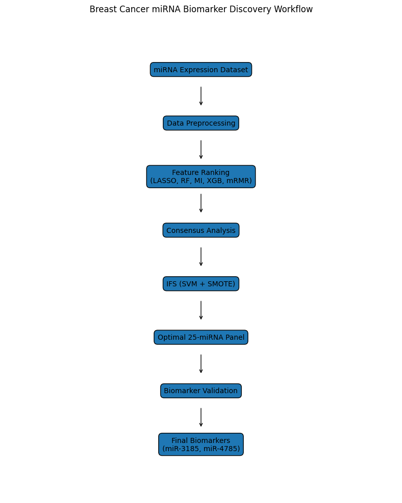
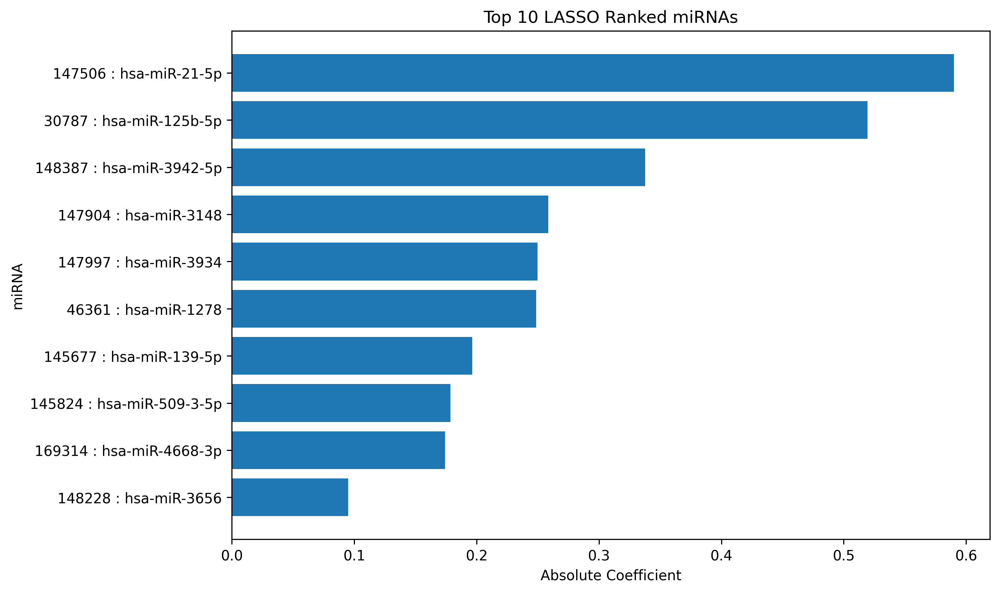
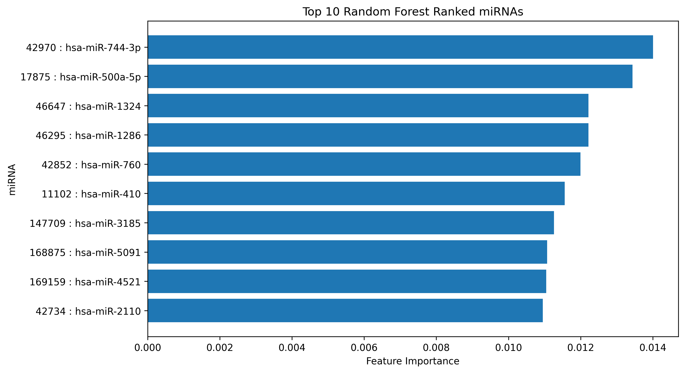
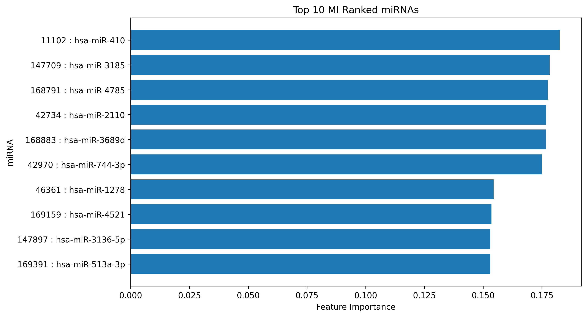
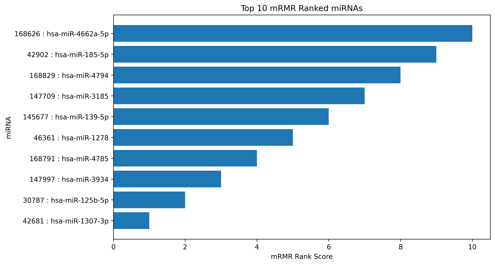
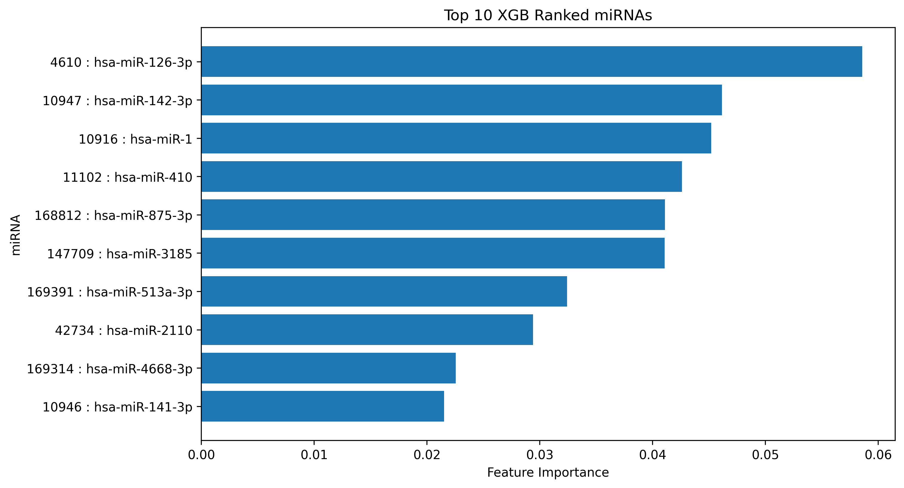
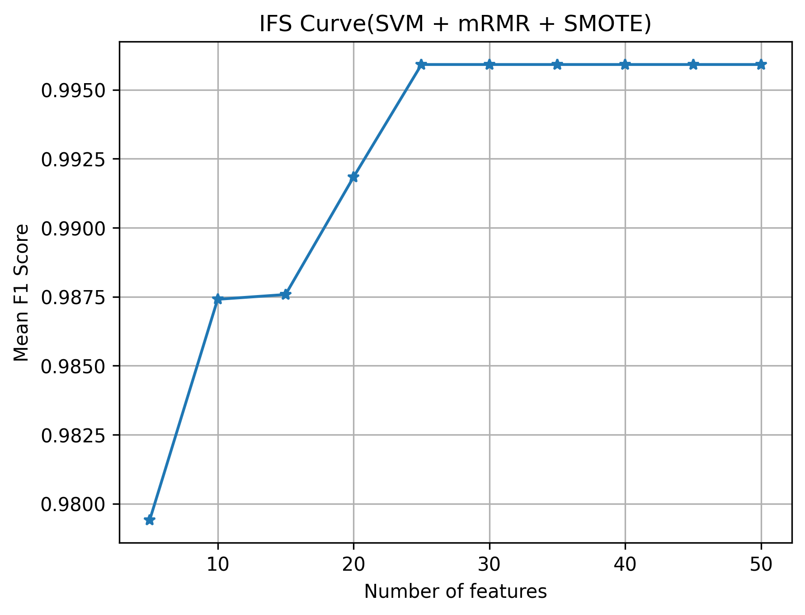
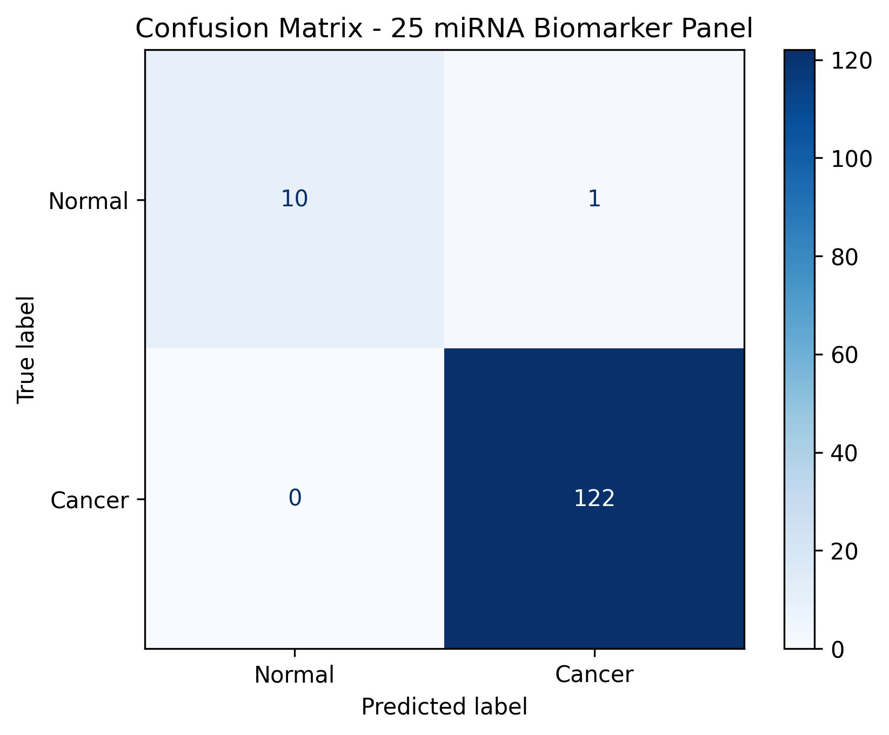

# Breast Cancer miRNA Biomarker Discovery

## Overview

This project focuses on the identification and validation of candidate miRNA biomarkers for distinguishing breast cancer and normal tissue samples using bioinformatics and machine learning approaches.

A consensus-based feature selection framework was developed by integrating multiple feature ranking methods, followed by biomarker panel optimization using Incremental Feature Selection (IFS) and validation using a Support Vector Machine (SVM) classifier.

---

## Workflow



---

## Dataset

* **Total Samples:** 133
* **Breast Cancer Samples:** 122
* **Normal Samples:** 11
* **miRNA Features:** 1926

Each sample is represented by expression levels of 1926 circulating miRNAs.

---

## Methodology

### 1. Data Preprocessing

* Data cleaning and preparation
* Feature extraction
* Label encoding

### 2. Feature Ranking

Five independent feature ranking methods were applied:

* LASSO
* Random Forest (RF)
* Mutual Information (MI)
* XGBoost (XGB)
* Minimum Redundancy Maximum Relevance (mRMR)

### 3. Consensus Biomarker Discovery

Features consistently selected by multiple ranking methods were identified as high-confidence candidate biomarkers.

### 4. Incremental Feature Selection (IFS)

* mRMR-ranked features were used for IFS.
* Linear SVM was employed as the evaluation classifier.
* SMOTE was applied within training folds to address class imbalance.
* 5-fold Stratified Cross Validation was used for performance evaluation.

### 5. Biomarker Panel Validation

The optimal biomarker panel was validated using:

* Accuracy
* Precision
* Recall
* F1 Score
* ROC-AUC

---

## Feature Ranking Results

### LASSO Top Features



### Random Forest Top Features



### Mutual Information Top Features



### mRMR Top Features



### XGBoost Top Features



---

## Incremental Feature Selection

The optimal number of biomarkers was determined using Incremental Feature Selection (IFS).



IFS identified an optimal biomarker panel consisting of **25 miRNAs**, achieving the highest classification performance while maintaining model simplicity.

---

## Final Biomarker Panel Validation

The final 25-miRNA biomarker panel was evaluated using a Linear SVM classifier with SMOTE and 5-fold Stratified Cross Validation.



### Validation Performance

| Metric    | Mean Score |
| --------- | ---------: |
| Accuracy  |     0.9923 |
| Precision |     0.9920 |
| Recall    |     1.0000 |
| F1 Score  |     0.9959 |
| ROC-AUC   |     0.9917 |

---

## Key Findings

### Consensus Biomarkers

The following miRNAs were consistently identified across all five feature ranking methods:

* **hsa-miR-3185**
* **hsa-miR-4785**

These biomarkers demonstrated the strongest evidence of association with breast cancer and were retained within the final validated biomarker panel.

### Optimal Biomarker Panel

* 25 miRNAs selected through mRMR + IFS
* Mean F1 Score: **0.9959**
* Mean ROC-AUC: **0.9917**

---

## Repository Structure

```text
results/
├── lasso_feature_ranking.csv
├── rf_feature_ranking.csv
├── mi_feature_ranking.csv
├── xgb_feature_ranking.csv
├── mrmr_feature_ranking.csv
├── final_biomarker_panel.csv
├── optimal_25_miRNA_panel.csv
├── ifs_results.csv
└── final_validation_results.csv

figures/
├── Confusion_Matrix.png
├── IFS_Curve.png
├── Lasso_top10.png
├── MI_top10.png
├── mRMR_top10.png
├── RF_top10.png
└── XGB_top10.png
```

---

## Technologies Used

* Python
* Pandas
* NumPy
* Scikit-learn
* XGBoost
* mRMR
* Imbalanced-learn
* Matplotlib

---

## Conclusion

A consensus-based machine learning framework successfully identified and validated candidate miRNA biomarkers for breast cancer classification. The proposed 25-miRNA biomarker panel demonstrated excellent classification performance, while hsa-miR-3185 and hsa-miR-4785 emerged as the most robust biomarkers through multi-method consensus analysis.

---

## Future Work

* Biological pathway enrichment analysis
* Independent external dataset validation
* Experimental validation of candidate biomarkers
* Molecular subtype biomarker discovery using unsupervised learning
* Integration with clinical and genomic data
